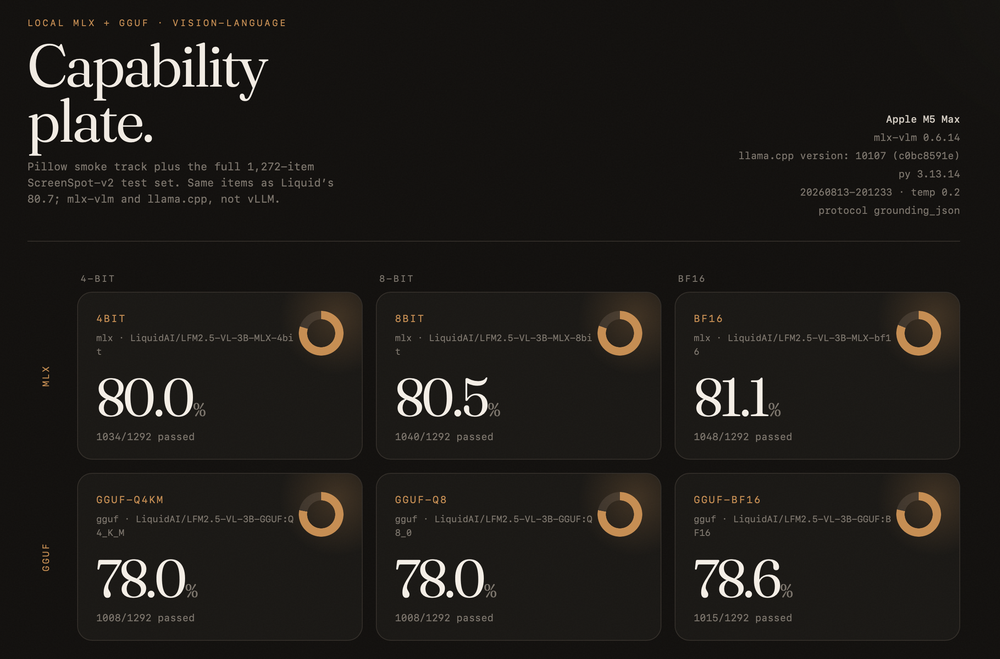
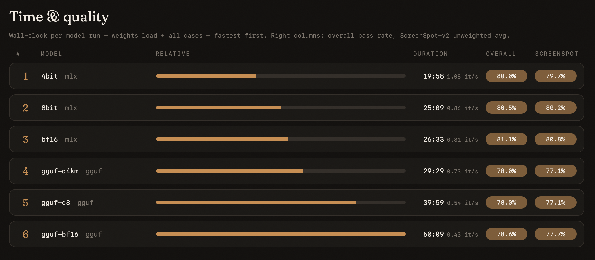

# VLM bake-off — MLX vs GGUF

Vision-language bake-off for Apple Silicon: the same vision benchmarks — ScreenSpot-v2, RefCOCO, DocVQA, InfographicVQA and BLINK today, more datasets and custom cases to come — run head-to-head across two interchangeable backends, **MLX** ([mlx-vlm](https://github.com/Blaizzy/mlx-vlm), native Metal) and **GGUF** ([llama.cpp](https://github.com/ggml-org/llama.cpp) via a local `llama-server`), with identical prompts, scoring, and sampling so the comparison is apples-to-apples within one report.

This is **not** a VLMEvalKit/vLLM reproduction. The ScreenSpot-v2 track uses the same 1,272 test items Liquid scored at 80.7, but inference is local (and usually quantized). With the tiling fix and the official grounding protocol, local MLX bf16 reaches 80.8 — matching the published number. The subset tracks land just as close: RefCOCO 89.6–90.6 (IoU rule) vs 87.9, DocVQA 90.1–91.3 vs 91.1, InfographicVQA 67.8–69.9 vs 70.2, and BLINK 62.9–65.2 vs 61.5 — all within subset/sampling noise of vLLM, with no systematic MLX-vs-GGUF gap outside the screenshot-specific ScreenSpot deficit.

## Backends

| Backend | Engine | Reference macro (bf16) | Notes |
| --- | --- | --- | --- |
| MLX | mlx-vlm ≥ 0.6.14 (fork with LFM2.5-VL tiling, [PR #1885](https://github.com/Blaizzy/mlx-vlm/pull/1885)) | **80.8%** | Accuracy and speed reference; runs the full 1,272-item set in ~27 min |
| GGUF | llama.cpp ≥ b10107 (`llama-server` + mmproj) | 77.7% | Tiles like the official pipeline; ~3pp behind MLX on tiled items (tile/thumbnail downsampling — upstream issue pending) |

Aliases: `4bit`, `5bit`, `6bit`, `8bit`, `bf16` → official LiquidAI **MLX** repos. GGUF aliases: `gguf-q4`, `gguf-q4km`, `gguf-q5`, `gguf-q6`, `gguf-q8`, `gguf-bf16`, `gguf-f16` → [`LiquidAI/LFM2.5-VL-3B-GGUF`](https://huggingface.co/LiquidAI/LFM2.5-VL-3B-GGUF). Any other mlx-vlm Hugging Face id or local `.gguf` path works; mix freely in `--models`.

GGUF needs `llama-server` on PATH (`brew install llama.cpp`). Weights and the matching mmproj are downloaded with `huggingface_hub` first, then `llama-server` is started on a local port (Q4–Q8 use the Q8_0 projector). Same tasks and scorers as MLX.

## Results — latest runs

### ScreenSpot-v2 (full 1,272-item test set)

`grounding_json` protocol, temp 0.2 / top_k 50, Apple M5 Max (`results/20260813-201233`):

| Model | desktop | mobile | web | macro avg |
| --- | --- | --- | --- | --- |
| `4bit` | 79.6 | 82.8 | 76.7 | 79.7 |
| `8bit` | 80.5 | 81.4 | 78.7 | 80.2 |
| `bf16` | **81.1** | **82.8** | 78.5 | **80.8** |
| `gguf-q4km` | 71.3 | 81.4 | 78.5 | 77.1 |
| `gguf-q8` | 71.3 | 80.4 | **79.6** | 77.1 |
| `gguf-bf16` | 72.5 | 80.6 | 80.1 | 77.7 |
| *Liquid published (vLLM, bf16)* | *78.7* | *81.2* | *82.2* | *80.7* |

Speed ranking from the same run (wall-clock per model: weights load + all cases — this run predates the Pillow-track removal, so 1,272 ScreenSpot + 20 smoke cases) — MLX is both faster and more accurate, and 4-bit keeps almost all of the quality at half the time:

| # | Model | Duration | Throughput | Macro avg |
| --- | --- | --- | --- | --- |
| 1 | `4bit` | 19:58 | 1.08 it/s | 79.7 |
| 2 | `8bit` | 25:09 | 0.86 it/s | 80.2 |
| 3 | `bf16` | 26:33 | 0.81 it/s | **80.8** |
| 4 | `gguf-q4km` | 29:28 | 0.73 it/s | 77.1 |
| 5 | `gguf-q8` | 39:58 | 0.54 it/s | 77.1 |
| 6 | `gguf-bf16` | 50:09 | 0.43 it/s | 77.7 |

From the generated `REPORT.html`:




### RefCOCO grounding (512-item seeded subset)

All six model combos, same `grounding_json` recipe and sampling (temp 0.2 / top_k 50), Apple M5 Max (`results/20260814-082154`). Family columns roll up the per-split table in that run's `REPORT.md`:

| Model | RefCOCO | RefCOCO+ | RefCOCOg | avg — center | avg — IoU ≥ 0.5 |
| --- | --- | --- | --- | --- | --- |
| `4bit` | 96.4 | 89.1 | 95.3 | 93.4 | 89.5 |
| `8bit` | 97.4 | 89.1 | 95.3 | 93.8 | 89.6 |
| `bf16` | 96.9 | 89.1 | 96.1 | 93.8 | 89.6 |
| `gguf-q4km` | 96.9 | 87.5 | 96.9 | 93.4 | 90.2 |
| `gguf-q8` | 96.9 | 89.1 | 96.1 | 93.8 | 90.6 |
| `gguf-bf16` | 96.9 | 88.5 | 97.7 | 93.9 | 90.6 |
| *Liquid published (vLLM, bf16)* | | | | | *87.9* |

Reading these: Liquid publishes only the 8-split average as "RefCOCO-avg 87.9 (P@1)" without the hit rule, so both rules are reported — the IoU ≥ 0.5 column is the one tracking the published number (89.5–90.6 vs 87.9; the residual ~2pp is consistent with subset noise + one-expression-per-region prep + temp-0.2 sampling). Three findings worth keeping: **no MLX-vs-GGUF gap** on this track (unlike ScreenSpot, where GGUF's tile downsampling costs ~3pp — COCO photos are near the tile size, so tiling barely engages), **4-bit is free** (within noise of bf16 on both backends), and RefCOCO+ testB is the hardest split for everyone (~82–86%) — description-only expressions on multi-instance scenes. Wall-clock: 2.0–4.6 min per MLX model and 6.2–12.7 min per GGUF model — ~4× faster per item than ScreenSpot (smaller images, fewer tiles, same short JSON output).

### DocVQA (500-item seeded subset)

All six model combos, canonical short-answer instruction, official ANLS scoring, temp 0.2 / top_k 50, Apple M5 Max (`results/20260814-123408`). Per-question-type breakdown in that run's `REPORT.md`:

| Model | ANLS |
| --- | --- |
| `4bit` | 90.1 |
| `8bit` | 90.5 |
| `bf16` | 90.1 |
| `gguf-q4km` | 90.3 |
| `gguf-q8` | 90.6 |
| `gguf-bf16` | **91.3** |
| *Liquid published (vLLM, bf16)* | *91.1* |

Reading these: every combo lands within ±1pp of the published 91.1 (a 500-item subset carries ~±1.4pp of noise at this accuracy, so the ordering inside the band is not meaningful). The interesting finding is what *doesn't* show: **no GGUF gap on dense document pages** — tiling engages heavily on ~1700×2200 pages, yet GGUF matches MLX and gguf-bf16 even edges past the published number. The ScreenSpot ~3pp GGUF deficit is therefore screenshot-specific, not a general tile-downsampling penalty. As on RefCOCO, **4-bit is free**. Hardest types everywhere: `free_text` (~85–88) and `table/list` (~86–90); the 75% `Yes/No` row is a 4-item group — one miss. Wall-clock: 5.2–6.6 min per MLX model, 9.0–10.3 min per GGUF model.

### InfographicVQA (500-item seeded subset)

Same recipe as DocVQA, denser mixed text/figure layouts (`results/20260814-142525`):

| Model | ANLS |
| --- | --- |
| `4bit` | 69.6 |
| `8bit` | 69.0 |
| `bf16` | **69.9** |
| `gguf-q4km` | 67.8 |
| `gguf-q8` | 68.9 |
| `gguf-bf16` | 68.1 |
| *Liquid published (vLLM, bf16)* | *70.2* |

Reading these: the whole band sits 0.3–2.4pp under the published number, with MLX bf16 dead on (69.9 vs 70.2) and GGUF running ~1–2pp behind MLX — the first track where GGUF trails at all, though the gap is within subset noise (~±2pp) and much smaller than ScreenSpot's screenshot-specific deficit. Hardest answer type everywhere: `non-extractive` (~53–58) — questions requiring synthesis rather than copying a span. Wall-clock: ~9–13 min per model.

### BLINK (224-item seeded subset)

All six combos, canonical lettered-choice prompts, 1–4 images per item (`results/20260814-142525`):

| Model | Overall accuracy |
| --- | --- |
| `4bit` | 62.9 |
| `8bit` | **65.2** |
| `bf16` | 64.7 |
| `gguf-q4km` | **65.2** |
| `gguf-q8` | **65.2** |
| `gguf-bf16` | 62.9 |
| *Liquid published (vLLM, bf16)* | *61.5* |

Reading these: every combo lands at or above the published 61.5 (62.9–65.2; ±3.2pp subset noise at n=224, so treat the in-band ordering as noise). The key implementation result: **no MLX-vs-GGUF divergence on multi-image inputs** — both backends' multi-image plumbing (image ordering, per-image tiling) produces matching distributions, including on the genuinely multi-image tasks (Jigsaw 100% everywhere, Visual Correspondence 81–94%). Per-task cells are n=16 and noisy; the stable pattern across all six models: depth/spatial/counting tasks strong (~75–90%), while Forensic Detection, IQ Test, Functional Correspondence and Multi-view Reasoning are hard for everyone (~19–63%) — consistent with BLINK's design as a model-agnostic stress test.

## Tracks

- **ScreenSpot-v2** — GUI screenshots from [`HongxinLi/ScreenSpot_v2`](https://huggingface.co/datasets/HongxinLi/ScreenSpot_v2) (OS-Copilot splits: 501 mobile / 334 desktop / 437 web). Click-in-box scoring. Default prepare is the **full 1,272-item test set**. `--screenspot subset` is 48 seeded items (16 per platform).
- **RefCOCO** — referring-expression grounding on COCO photos from the [`lmms-lab-encoder`](https://huggingface.co/lmms-lab-encoder) grounding sets (RefCOCO / RefCOCO+ / RefCOCOg — the 8 eval splits behind Liquid's published RefCOCO-avg 87.9, P@1, vLLM 0.26). Same `grounding_json` recipe as ScreenSpot; both hit rules (box center in gold, IoU ≥ 0.5) are reported until Liquid's P@1 rule is pinned. Default prepare is a **512-item seeded subset** (64 per split, ~4 GB download); `--refcoco full` is all 25,770 items (~5 GB, hours per model — the comparable number is the 8-split average).
- **DocVQA** — document reading comprehension from [`lmms-lab-encoder/DocVQA`](https://huggingface.co/datasets/lmms-lab-encoder/DocVQA) (official validation split behind Liquid's published 91.1 ANLS, vLLM 0.26). Free-form short answers with the canonical single-word/phrase instruction, scored by official ANLS (Levenshtein, threshold 0.5, errors count 0); grouped by question type in the report. Default prepare is a **500-item seeded subset** (~1 GB download); `--docvqa full` is all 5,349 questions. Matrix on the subset: 90.1–91.3 ANLS across all six model combos vs 91.1 published.
- **InfographicVQA** — same repo, config and scorer as DocVQA (behind Liquid's published 70.2 ANLS). Denser mixed text/figure layouts, and a lower reference score with more headroom to separate implementations. Default prepare is a **500-item seeded subset**; `--infographicvqa full` is 2,801 questions.
- **BLINK** — multi-image perceptual tasks from [`BLINK-Benchmark/BLINK`](https://huggingface.co/datasets/BLINK-Benchmark/BLINK) (14 tasks, 1–4 images per item, behind Liquid's published 61.5 overall accuracy). Canonical lettered-choice prompts with a letter-extraction scorer; per-task breakdown in the report. The only multi-image track — it exercises the multi-image plumbing of both backends (ordering, per-image tiling). Default prepare is a **224-item seeded subset** (16 per task); `--blink full` is the whole 1,901-item validation split.
- **MathVista** — visual math reasoning from [`AI4Math/MathVista`](https://huggingface.co/datasets/AI4Math/MathVista) (testmini: 1,000 items, 540 multiple-choice + 460 short free-form, behind Liquid's published 68.5). Multiple choice scores by option letter; free-form by tolerant numeric/text match. Liquid's number uses a CoT-style eval pipeline while this suite scores **direct answers**, so treat the local accuracy as a lower bound vs their setup. Default prepare is the full testmini; `subset` = 300 seeded, or pass N.
- **MMMU** — college-level multi-discipline multiple choice from [`MMMU/MMMU`](https://huggingface.co/datasets/MMMU/MMMU) (validation split, behind Liquid's published 48.4). ~850 scored items over 30 subjects (2–9 options each; 53 val items are open-ended with free-text answers and no usable options, so they're skipped; some rows ship options as a stringified list — parsed at prepare time). 42 items carry 2+ images. Default prepare is the full val MC set; `subset` = 300 seeded, or pass N.
- **Speed** — separate `bench speed` command (TTFT / wall-clock tok/s / peak memory). Not part of `run`.

## Setup

```bash
uv venv
uv pip install -e .
```

`pyproject.toml` pins mlx-vlm to the LFM2.5-VL tiling fix via a `[tool.uv.sources]` **git source** — the [PR #1885](https://github.com/Blaizzy/mlx-vlm/pull/1885) branch on GitHub, so no local checkout is needed, and the committed `uv.lock` pins the exact commit (the branch head moves; the lock is what makes installs reproducible — don't regenerate it casually). Without the pin, `uv run` would fall back to the published mlx-vlm and MLX ScreenSpot numbers drop ~16pp (reports flag this via the recorded mlx-vlm version). To hack on a local fork instead, temporarily swap the source for `{ path = "../path/to/mlx-vlm", editable = true }`; once the fix ships in a release, delete the block and relock.

### Fresh machine (quickstart)

Images and dataset caches are never committed — `prepare` is a required step on a new clone, not an optimization. Full sequence, verified end-to-end on macOS / Apple Silicon:

```bash
git clone https://github.com/ivanfioravanti/vlm-bakeoff.git && cd vlm-bakeoff
brew install llama.cpp                    # only needed for the GGUF side
uv venv && uv pip install -e .            # installs the mlx-vlm commit pinned in uv.lock
uv run python -m bench prepare            # downloads datasets (~17 GB) and regenerates all images
uv run python -m bench run --models 4bit,8bit,bf16,gguf-q4km,gguf-q8,gguf-bf16
open "results/$(ls -t results | head -1)/REPORT.html"
```

Disk budget for the full six-model setup: ~12 GB MLX weights + ~11 GB GGUF repo + ~17 GB dataset caches (all under `$HF_HOME` — default `~/.cache/huggingface`; nothing in the stack hardcodes a cache path, so pointing `HF_HOME` at another volume relocates every download) + ~1.2 GB extracted images — plan for ~40 GB. Single-track setups are far lighter (BLINK subset alone is <1 GB). Two practical notes: export `HF_TOKEN` before the big downloads to avoid anonymous rate limits, and each model's weights download on its first `run`. For like-for-like cross-machine comparisons, keep the same `--models` list and default sampling — the chip is recorded in every report automatically.

## Web UI

```bash
uv run python -m bench ui          # http://127.0.0.1:8765 (opens automatically)
```

A localhost web app (stdlib only — no extra dependencies) that wraps the same CLI: pick models (the MLX/GGUF aliases or any mlx-vlm HF id), tick benchmark tracks, tweak the usual options (`--temp`, `--top-k`, `--batch-size`, `--limit`, protocol), and Start. Runs execute exactly as they do from the terminal — same subprocess, same per-item checkpoints, same reports — with live per-model progress bars, pass counts, and a streaming log. Stop kills the whole process group (llama-server included) and any partial run appears in the resume picker; finished runs are listed with their overall scores and their self-contained `REPORT.html` opens inline. One run at a time (the GPU is serial); `--host 0.0.0.0` exposes it on the LAN if you ever want to drive it from another device.

## Run

```bash
uv run python -m bench prepare                 # ScreenSpot full (1,272) + MathVista testmini (1,000) + MMMU val MC (847) + 500-item subsets of every other track
uv run python -m bench prepare --screenspot subset
uv run python -m bench prepare --refcoco full --screenspot off   # all 25,770 RefCOCO items
uv run python -m bench prepare --docvqa full --screenspot off --refcoco off   # all 5,349 DocVQA questions
uv run python -m bench prepare --docvqa 2000 --infographicvqa 2000 --screenspot off --refcoco off --blink off  # custom seeded subsets
uv run python -m bench prepare --blink full --screenspot off     # full BLINK val (1,901)
uv run python -m bench run --models 6bit,8bit,bf16              # MLX only
uv run python -m bench run --models bf16,gguf-q8,gguf-bf16      # mixed backends, one report
uv run python -m bench run --models 8bit --protocol bbox        # plain-box protocol (ScreenSpot only)
uv run python -m bench run --models bf16 --categories refcoco   # one track (screenspot|refcoco|docvqa|infographicvqa|blink|mathvista|mmmu)
uv run python -m bench run --models bf16 --limit 50             # smoke test on the first 50 tasks
uv run python -m bench speed --models 6bit,8bit,bf16
```

`--docvqa` / `--infographicvqa` accept `off | subset | full | N`: an integer builds a seeded N-item subset from the same shuffle as the 500-item one (so 500 stays a prefix of it). Already-downloaded page images are reused and unreferenced ones are pruned.

Every `run` appends each scored item to `results/<timestamp>/checkpoints/<model>.jsonl` as it completes, so a killed or crashed run resumes where it left off: `uv run python -m bench run --resume results/<timestamp> ...` (same task list required — the checkpoint header carries a fingerprint and refuses mismatched resumes; per-session wall time is footed in the checkpoint so resumed runs keep honest totals). Runs default to concurrency 2 (`--batch-size`): MLX routes single-image tasks through mlx-vlm `batch_generate` (multi-image BLINK items stay sequential; requires the fork's `lfm2vl-batch-fix` branch), GGUF keeps N requests in flight against parallel `llama-server` slots. Measured on M5 Max across batch 1/2/4/8: MLX is vision-tower/prefill-bound and flat at every size, GGUF gains ~10% at 2–4 slots and loses ~1.7x at 8 — 2 is the default. If the batched path fails repeatedly the runner automatically falls back to sequential for the rest of that model. Per-item timings (`gen_s`) and live items/min + ETA are recorded in every run.

Default run is `6bit,8bit,bf16`. Full ScreenSpot-v2 is 1,272 inferences per model, plus any custom tasks you add (see below). Protocol variants (`--protocol`) apply to ScreenSpot only; every other track runs one canonical recipe (RefCOCO grounding JSON, ANLS tracks the single-word/phrase instruction, BLINK the benchmark's lettered-choice prompt).

Default sampling matches Liquid's recommended generation parameters (`--temp 0.2 --top-k 50`, sampling on — what their 80.7 was measured with), so expect ±1–2pp run-to-run variance. Pass `--temp 0` for greedy, reproducible runs. Each run writes `REPORT.html`, `REPORT.md`, and `results.json` under `results/<timestamp>/`. Open the HTML file in a browser. ScreenSpot reports desktop / mobile / web plus the unweighted average Liquid uses for 80.7.

### Reading the ScreenSpot numbers

With the current defaults — tiling on (mlx-vlm ≥ 0.6.14 fork) and the `grounding_json` protocol — local MLX bf16 reaches **80.8%** macro, matching Liquid's published 80.7. Two measured findings got it there:

- **Image preprocessing matters (~+6pp).** The official pipeline tiles large screenshots into up to 10×512² tiles + overview; the stock mlx-vlm patch disabled that. Fixed in [Blaizzy/mlx-vlm#1885](https://github.com/Blaizzy/mlx-vlm/pull/1885) (pinned here via `tool.uv.sources`). llama.cpp (≥ b10107) always tiled, but its tile/thumbnail downsampling leaves GGUF ~3pp behind MLX (gap concentrated on tiled items).
- **Prompt protocol matters (~+16pp).** The default `grounding_json` protocol is the docs.liquid.ai grounding recipe — system prompt specifying the JSON `bbox_2d` array, which is the model's native grounding format. Alternatives: `--protocol bbox` (plain `[0,1000]` box, 64.3% macro) and `--protocol pyautogui` (Liquid's literal ScreenSpot-v2 harness wording — historically what produced the 80.7, but only ~7% locally):

```bash
uv run python -m bench run --models gguf-bf16 --protocol pyautogui
```

```bash
uv run python -m bench report                 # rebuild HTML from the latest run
uv run python -m bench report results/20260812-164252/results.json
```

## Add your own cases later

Drop images in `data/images/custom/` and a JSON file in `data/tasks/`:

```json
{
  "id": "gui_settings_ios",
  "category": "gui",
  "images": ["custom/ios_settings.png"],
  "prompt": "Locate the Wi-Fi row. Reply with only the bounding box as xmin, ymin, xmax, ymax, using integers from 0 to 1000.",
  "scorer": "bbox_iou",
  "expected": {"bbox": [40, 220, 960, 310], "iou": 0.5}
}
```

Scorers: `contains`, `exact`, `bbox_iou`, `click_in_box`, `click_point`, `choice`.

**On bracketed literals in prompts.** The original (untiled, plain-bbox) stack lost huge accuracy to format echoes: a bracketed literal like `[0, 1000]` in the user prompt came back verbatim as the answer and the parser read the echo as a prediction — 14.6% vs 58.3% on a 48-item slice. That mechanism does **not** reproduce on the current tiled stack (0 echoes across literal / no-literal / numeric-literal / JSON-protocol variants, GGUF Q8): when this model can't find a target it emits its own whole-image box `[0, 0, 1000, 1000]` — a model failure mode, not an echo — and the default `grounding_json` system prompt itself contains `[xmin, ymin, xmax, ymax] … in [0, 1000]` verbatim (official recipe) with no ill effect, because the model anchors to its trained JSON format. The old rule is still cheap hygiene for custom plain-box prompts (the parser will happily read any echoed bracket), just no longer a measurable hazard. Shared wording lives in `bench/prompts.py`.
